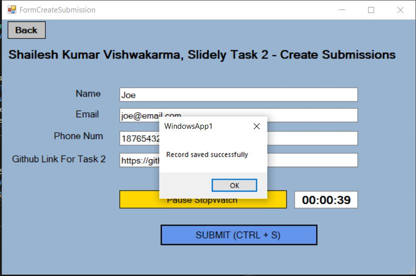

# VB.NET Windows Forms Application with TypeScript + Express Server

This project is a Windows Forms application written in VB.NET that interacts with a TypeScript + Express server. The application allows users to create, read, update, and delete entries stored in a JSON file on the server. The entries consist of name, email, phone number, GitHub link, and time spent (measured by a stopwatch).


## Table of Contents

- [Prerequisites](#prerequisites)
- [Setup Instructions](#setup-instructions)
  - [Backend Setup](#backend-setup)
  - [Frontend Setup](#frontend-setup)
- [Application Features](#application-features)
- [Keyboard Shortcuts](#keyboard-shortcuts)
- [Error Handling](#error-handling)
- [Usage](#usage)
  - [Creating an Entry](#creating-an-entry)
  - [Viewing Entries](#viewing-entries)
  - [Deleting an Entry](#deleting-an-entry)
  - [Updating an Entry](#updating-an-entry)

## Prerequisites

- Visual Studio 2022
- Node.js and npm
- .NET Framework

## Setup Instructions

### Hosting an Express Server Locally for Backend 

1. **Install Node.js**:
   - Installed node.js from `visual studio installer`.

2. **Initialize Express Project**:
   - Open a terminal or command prompt.
   - Create a new directory for your Express project:
     ```sh
     mkdir NodejsWebApp1
     ```
   - Navigate into your project directory:
     ```sh
     cd NodejsWebApp1
     ```
   - Initialize a new npm project:
     ```sh
     npm init -y
     ```

3. **Install Express and dependencies**:
   - Install Express as a dependency for your project:
     ```sh
     npm install express
     ```

    ```sh
    npm init -y
    npm install express body-parser
    npm install --save-dev typescript ts-node @types/node @types/express
    ```

4. **Setup TypeScript configuration:**

    Create `tsconfig.json`:

    ```json
    {
        "compilerOptions": {
            "target": "ES6",
            "module": "commonjs",
            "outDir": "./dist",
            "rootDir": "./src",
            "strict": true,
            "esModuleInterop": true
        }
    }
    ```

5. **Create server files:**

    Create `src/index.ts` and `db.json`:

    ```sh
    mkdir src
    cd src
    touch index.ts db.json
    ```
    
6. **Create Express Server**:
   - Created a file named `server.js` in project directory `NodejsWebApp1/NodejsWebApp1/server.js`
   - Open `server.js` and wrote Express server code. For example:
     ```javascript
     const express = require('express');
     const app = express();
     const port = 3000;

     app.get('/', (req, res) => {
       res.send('Hello World!');
     });

     app.listen(port, () => {
       console.log(`Express server listening at http://localhost:${port}`);
     });
     ```

7. **Run Express Server**:
   - In the terminal, run your server:
     ```sh
     node server.js
     ```
   - You should see a message indicating that your Express server is running on `http://localhost:3000`.


8. **Build and start the server:**

    ```sh
    npx tsc
    npx ts-node src/index.ts

    # Server is running on http://localhost:3000
    ```
9. **Check on browser:**
   ```sh
   Ping Endpoint: Open a browser and go to http://localhost:3000/ping. You should see "true" always while the server is running.
   ```

   

### Frontend Setup

Create Windows Forms Application

1. **Open Visual Studio**
   - Launched Visual Studio on your computer.

2. **Create a New Project**
   - Go to `File > New > Project`.
   - Select `Windows Forms App (.NET Framework)` and clicked `Next`.
   - Named `WindowsApp1` project, chose a location, and clicked `Create`.

3. **Design Forms**:
   - Once the project is created, we can see `Form1.vb` (or similar) in the Solution Explorer.
   - Double-click `Form1.vb` to open the designer.
   - Design form by dragging and dropping controls from the Toolbox onto the form.
   - Similarly all the other required forms were designed.

4. **Write Visual Basic Code**:
   - Double-click on any control on the form to create an event handler (e.g., `Button_Click`).
   - Wrote Visual Basic code in the event handlers to define the behavior of the application.
   - Linked all the forms.

5. **Build and Run**:
   - Press `F5` or click `Start` in the toolbar to build and run Windows Forms application.
   - The form designed will appear, and you can interact with it based on code.

## Application Features
- **Create Submission:** Allows users to enter and submit their details, including a stopwatch timer.
- **View Submissions:** Displays the details of submissions one by one with navigation buttons.
- **Update Submission:** Allows users to search for a submission by email and update the details.
- **Delete Submission:** Allows users to search for a submission by email and delete the entry.

## Keyboard Shortcuts

- **Create Submission:** `Ctrl + N`
- **View Submission:** `Ctrl + V`
- **Submit:** `Ctrl + S`
- **Previous Entry:** `Ctrl + P`
- **Next Entry:** `Ctrl + N`
- **Toggle Stopwatch:** `Ctrl + T`
- **Exit Application:** `Esc`

## Error Handling

The application includes robust error handling with `Try...Catch` blocks around critical operations to ensure graceful error handling and user notifications.

## Usage

### Creating an Entry

1. Open the application. 
2. Click on "Create Submission" or press `Ctrl + N`.
3. Fill in the details.
4. Use the stopwatch as needed.
5. Click "Submit" or press `Ctrl + S` to save the entry.

### Viewing Entries

1. Click on "View Submission" or press `Ctrl + V`.
2. Navigate through the entries using the "Previous" (`Ctrl + P`) and "Next" (`Ctrl + N`) buttons.

### Deleting an Entry

1. Click on "Delete Submission" and enter the email address.
2. Click "Search" to find the entry.
3. Click "Delete" to remove the entry from the database.

### Updating an Entry

1. Click on "Update Submission" and enter the email address.
2. Click "Search" to find the entry.
3. Update the details as needed.
4. Click "Update" to save the changes.

---
